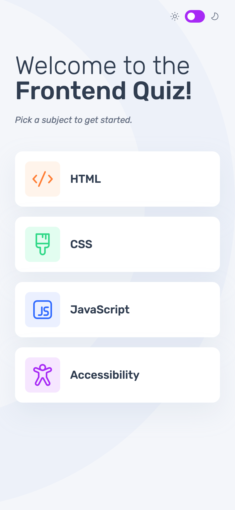
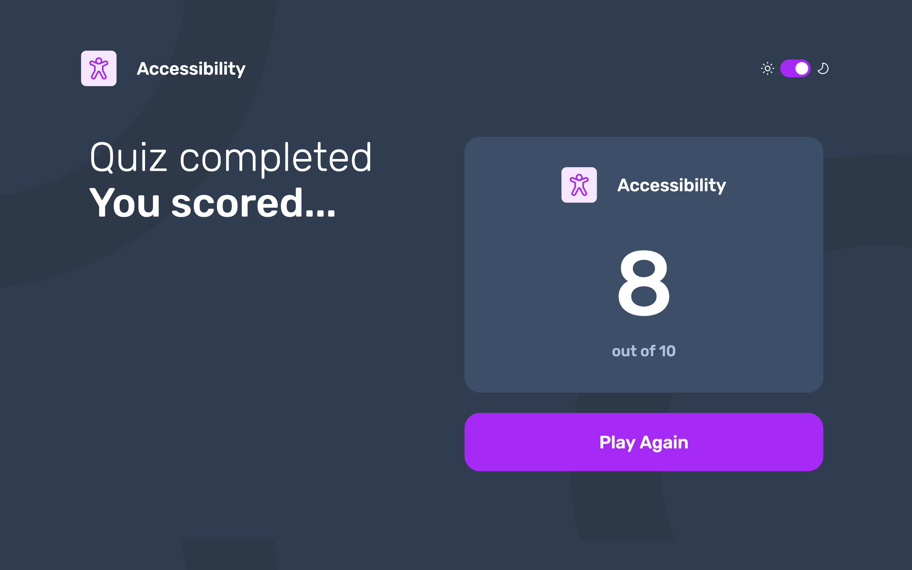
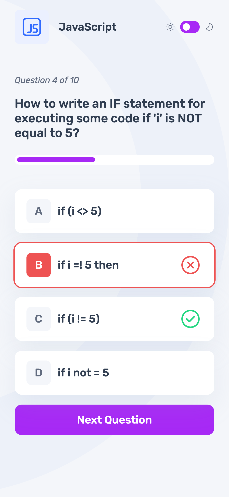

# Frontend Mentor - Frontend quiz app solution

This is a solution to the [Frontend quiz app challenge on Frontend Mentor](https://www.frontendmentor.io/challenges/frontend-quiz-app-BE7xkzXQnU). Frontend Mentor challenges help you improve your coding skills by building realistic projects.

## Table of contents

- [Frontend Mentor - Frontend quiz app solution](#frontend-mentor---frontend-quiz-app-solution)
  - [Table of contents](#table-of-contents)
  - [Overview](#overview)
    - [The challenge](#the-challenge)
    - [Screenshot](#screenshot)
    - [Links](#links)
  - [My process](#my-process)
    - [Built with](#built-with)
    - [What I learned](#what-i-learned)
    - [Continued development](#continued-development)
    - [Useful resources](#useful-resources)
  - [Author](#author)
  - [Acknowledgments](#acknowledgments)

## Overview

### The challenge

Users should be able to:

- Select a quiz subject
- Select a single answer from each question from a choice of four
- See an error message when trying to submit an answer without making a selection
- See if they have made a correct or incorrect choice when they submit an answer
- Move on to the next question after seeing the question result
- See a completed state with the score after the final question
- Play again to choose another subject
- View the optimal layout for the interface depending on their device's screen size
- See hover and focus states for all interactive elements on the page
- Navigate the entire app only using their keyboard
- **Bonus**: Change the app's theme between light and dark

### Screenshot

**Start menu (mobile)**


### Links

- Live Site URL: [GitHub Pages link](https://kmulqueen.github.io/frontend-quiz-app/)

## My process

### Built with

- [TypeScript](https://www.typescriptlang.org/)
- [React](https://reactjs.org/) - JS library
- [Vite](https://vite.dev/) - Frontend build tool
- [Tailwind CSS](https://tailwindcss.com/) - For styles
- Mobile-first workflow
- Semantic HTML5 markup
- CSS custom properties
- Flexbox
- CSS Grid

**Screenshot: Results page in dark mode (desktop)**


### What I learned

**Context API with useReducer:** I had to refactor all of my code because I had too many useState variables. This caused a mess of prop-drilling and was a giant pain to refactor. Moving from 15+ useState variables to a centralized state management system dramatically improved code organization. Using useReducer instead of useState made state updates predictable and easier to debug:

```tsx
// Before: Multiple scattered state updates
setSelectedAnswer(answer);
setAnswerSubmitted(true);
setIsCorrect(answer === correctAnswer);

// After: Single action with predictable state changes
dispatch({ type: "SUBMIT_ANSWER", payload: answer });
```

**Accessibility-First Development:** This project taught me the critical importance of semantic HTML and proper form accessibility. I initially implemented quiz answers as buttons, but learned that radio buttons with proper `<fieldset>`, `<legend>`, and `<label>` elements are essential for screen readers and keyboard navigation. The key insight was that you can hide radio buttons with `sr-only` while maintaining full accessibility:

```tsx
<input
  type="radio"
  className="sr-only"
  checked={isSelected}
  onChange={handleSelectAnswer}
/>
<label htmlFor={radioId}>
  {/* Custom styled content */}
</label>
```

**Polymorphic Components:** Building a flexible Container component that can render as any HTML element while maintaining TypeScript safety was a game-changer for semantic HTML:

```tsx
<Container as="section" aria-labelledby="quiz-section">
<Container as="fieldset" className="quiz-form">
```

**Screenshot: Question page with feedback (mobile)**


### Continued development

**Advanced Accessibility Patterns:** While I implemented basic accessibility, I want to explore more complex ARIA patterns, focus management strategies, and automated accessibility testing tools like axe-core.

**State Management Architecture:** I successfully used Context API for this project, but I want to compare it with other solutions like Zustand or Redux Toolkit to understand when each approach is most appropriate.

**CSS Architecture:** I mixed Tailwind utilities with custom CSS for responsive background images and dark mode. I want to develop a more systematic approach to handling complex responsive designs and theming patterns.

**Testing Strategy:** This project focused on implementation, but I need to develop skills in testing accessibility features, Context providers, and user interactions with tools like Jest and React Testing Library.

**Performance Optimization:** I want to learn about memoization patterns, code splitting, and performance monitoring to ensure smooth user experiences as applications grow in complexity.

### Useful resources

- [WCAG 2.1 Guidelines](https://www.w3.org/WAI/WCAG21/quickref/) - Essential reference for web accessibility standards. The quick reference format made it easy to check specific requirements for form controls and navigation.
- [MDN ARIA Best Practices](https://developer.mozilla.org/en-US/docs/Web/Accessibility/ARIA/ARIA_Techniques) - Helped me understand when and how to use ARIA attributes correctly, especially for form groups and live regions.
- [Tailwind CSS v4 Documentation](https://tailwindcss.com/docs) - The dark mode and responsive design sections were crucial for implementing theme switching with proper media queries.

## Author

- Website - [Kyle Mulqueen's GitHub](https://github.com/kmulqueen)
- Frontend Mentor - [@kmulqueen](https://www.frontendmentor.io/profile/kmulqueen)

## Acknowledgments

[Academind's Udemy course: "React & TypeScript - The Practical Guide"](https://www.udemy.com/course/react-typescript-the-practical-guide). This was essential for my understanding of using Context API and also building the Polymorphic Container component. It was a pretty quick course and I learned a lot about using React with TypeScript. Would highly recommend.
